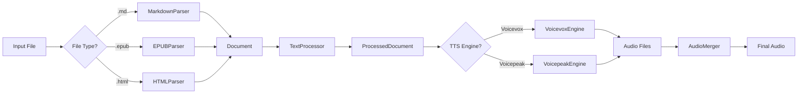

# 拡張可能な読み上げシステム アーキテクチャ提案

## 現状の課題
- 入力形式がEPUBに限定
- TTSエンジンがVoicepeakに限定
- モジュール間の結合度が高い

## 提案するアーキテクチャ

### 1. レイヤード・アーキテクチャ

```
┌─────────────────────────────────────────────────┐
│                   CLI/API Layer                  │
├─────────────────────────────────────────────────┤
│                 Orchestration Layer              │
├──────────────────┬──────────────────┬───────────┤
│   Input Parser   │ Text Processor   │   TTS     │
│    Interface     │                  │ Interface │
├──────────────────┼──────────────────┼───────────┤
│ • MarkdownParser │ • PauseInjector  │ • Voicevox│
│ • EPUBParser     │ • TextSplitter   │ • Voicepeak│
│ • HTMLParser     │ • StructureKeeper│           │
└──────────────────┴──────────────────┴───────────┘
```

### 2. 主要コンポーネント

#### 2.1 Input Parser Interface
```go
type InputParser interface {
    Parse(filePath string) (*Document, error)
    CanParse(filePath string) bool
}

type Document struct {
    Title    string
    Chapters []Chapter
    Metadata map[string]string
}

type Chapter struct {
    ID       string
    Title    string
    Level    int
    Content  []ContentBlock
}

type ContentBlock struct {
    Type     BlockType // Heading, Paragraph, List, etc.
    Level    int       // For headings
    Content  string
    Children []ContentBlock
}
```

#### 2.2 Text Processor
```go
type TextProcessor interface {
    Process(doc *Document, config ProcessConfig) (*ProcessedDocument, error)
}

type ProcessConfig struct {
    MaxChunkSize    int
    PauseStrategy   PauseStrategy
    PreserveStructure bool
}

type PauseStrategy interface {
    GetPause(blockType BlockType, level int) Pause
}

type Pause struct {
    Type     PauseType // Silence, FullWidthSpace, SSML
    Duration int       // milliseconds or character count
    Value    string    // actual pause representation
}
```

#### 2.3 TTS Engine Interface
```go
type TTSEngine interface {
    Name() string
    Initialize(config TTSConfig) error
    Synthesize(text string, outputPath string) error
    SupportsPause(pauseType PauseType) bool
    ConvertPause(pause Pause) string
}

type TTSConfig struct {
    Voice      string
    Speed      float64
    Pitch      float64
    Volume     float64
    OutputFormat string
}
```

### 3. ディレクトリ構成（提案）

```
epub2audio/
├── cmd/
│   └── epub2audio/
│       └── main.go
├── internal/
│   ├── parser/
│   │   ├── interface.go
│   │   ├── markdown.go
│   │   ├── epub.go
│   │   └── html.go
│   ├── processor/
│   │   ├── interface.go
│   │   ├── pause.go
│   │   ├── splitter.go
│   │   └── structure.go
│   ├── tts/
│   │   ├── interface.go
│   │   ├── voicevox.go
│   │   ├── voicepeak.go
│   │   └── factory.go
│   └── orchestrator/
│       └── pipeline.go
├── pkg/
│   └── audio/
│       └── merger.go
├── configs/
│   ├── default.yml
│   └── examples/
└── docs/
```

### 4. 実装フロー



### 5. Pause/Delay戦略

#### 5.1 Voicepeak向け
```yaml
pause_strategy:
  type: "fullwidth_space"
  mappings:
    h1: 18
    h2: 16
    h3: 14
    h4: 12
    paragraph_end: 4
    list_item: 2
```

#### 5.2 Voicevox向け
```yaml
pause_strategy:
  type: "voicevox_pause"
  mappings:
    h1: 2000  # ms
    h2: 1500
    h3: 1000
    h4: 800
    paragraph_end: 500
    list_item: 300
```

### 6. 設定ファイル例

```yaml
# config.yml
input:
  default_parser: "auto"  # auto, markdown, epub, html
  
processing:
  max_chunk_size: 140
  preserve_structure: true
  pause_strategy: "voicepeak_fullwidth"  # or "voicevox_native"
  
tts:
  engine: "voicepeak"  # or "voicevox"
  voicepeak:
    voice: "Japanese Female"
    speed: 1.0
  voicevox:
    speaker_id: 1
    speed_scale: 1.0
    
output:
  format: "mp3"
  bitrate: "128k"
  merge: true
```

### 7. CLI使用例

```bash
# 基本的な使用
epub2audio input.epub -o output.mp3

# Markdown入力、Voicevox使用
epub2audio input.md --engine voicevox -o output.wav

# 複数ファイル処理
epub2audio *.html --engine voicepeak --config custom.yml

# ドライラン（テキスト抽出のみ）
epub2audio input.epub --dry-run --output-text extracted.txt
```

### 8. 拡張性のポイント

1. **新しい入力形式の追加**
   - `InputParser`インターフェースを実装するだけ
   - PDFパーサーなども容易に追加可能

2. **新しいTTSエンジンの追加**
   - `TTSEngine`インターフェースを実装
   - Google TTS、Amazon Pollyなども対応可能

3. **Pause戦略のカスタマイズ**
   - `PauseStrategy`インターフェースで柔軟に対応
   - SSML、カスタムマークアップなども可能

4. **処理パイプラインの拡張**
   - ルビ処理、読み仮名付与などのプロセッサー追加可能